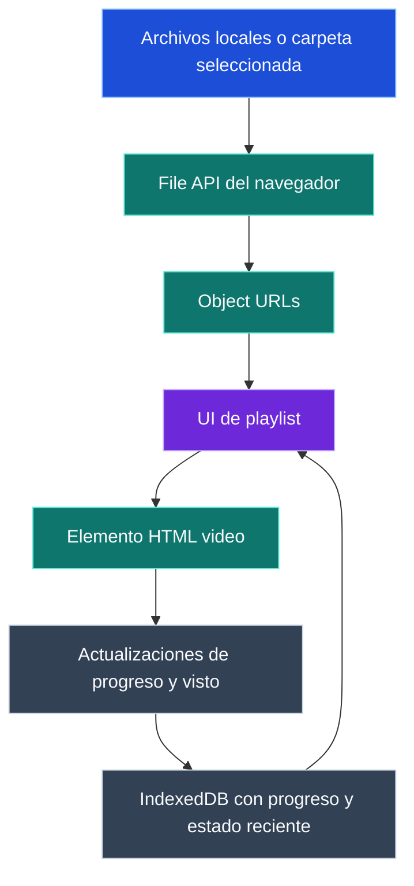

# The Player

[English](README.md)

The Player es un reproductor local de video, amigable para uso portátil, que corre en el navegador, reproduce archivos locales como lista y recuerda el progreso localmente.

## Funciones

- Descargá el ZIP portátil de Windows, descomprimilo y ejecutá `start.cmd` sin `npm install`.
- Seleccioná una carpeta o varios archivos de video y reproducilos en una lista determinística.
- Avanzá por los videos con controles de Anterior, Saltar siguiente, Marcar visto y seguir, y atajos de teclado.
- Buscá dentro de la playlist visible sin cambiar el orden de reproducción, el progreso guardado ni el video activo; las playlists largas quedan acotadas y scrollean internamente.
- Mantené la pantalla despierta durante la reproducción cuando el navegador soporte Screen Wake Lock.
- Recordá progreso, estado visto, último video activo y actividad reciente en IndexedDB del navegador.
- Usá inglés por defecto y español automáticamente cuando el idioma del navegador/sistema sea `es` o `es-*`.
- Mantené los videos locales en el navegador; los archivos seleccionados no se suben al servidor Node.
- Publicado bajo licencia MIT.

## Requisitos

- Release portátil de Windows: no hace falta instalar Node.js ni npm. El ZIP incluye `runtime\node.exe`.
- Checkout de código fuente o build portátil: Node.js 18 o posterior y npm.
- Un navegador compatible con reproducción de medios locales.

## Elegí tu instalación

Elegí el camino según lo que quieras hacer. La mayoría de los usuarios de Windows deberían empezar con el ZIP descargable del release.

Repositorio: <https://github.com/Dortecx/The-Player>

Release v1.4.3: <https://github.com/Dortecx/The-Player/releases/tag/v1.4.3>

### Descargar y ejecutar el portátil de Windows

Usá este camino si querés el paquete de Windows listo para ejecutar. No necesitás Node.js, npm ni `npm install` para esta opción.

1. Descargá el ZIP:

   <https://github.com/Dortecx/The-Player/releases/download/v1.4.3/The-Player-1.4.3-windows.zip>

2. Descomprimilo.
3. Abrí la carpeta extraída `The-Player-1.4.3-windows`.
4. Hacé doble clic en `start.cmd`.
5. Usá la ventana del navegador que se abre en <http://127.0.0.1:3000/>.

El release portátil incluye `runtime\node.exe`, los archivos de la app y el lanzador. No requiere `node_modules`, metadatos de Git ni un entorno local de desarrollo.

### Crear y ejecutar el portátil de Windows

Usá este camino si querés crear el mismo ZIP portátil desde un checkout de código fuente en Windows.

```powershell
git clone https://github.com/Dortecx/The-Player.git
cd The-Player
npm run build:portable:win
```

Crealo en Windows con Node.js 18 o posterior disponible en el `PATH`. El build genera:

```text
portable-win\The-Player-1.4.3-windows.zip
```

Descomprimí ese archivo y ejecutá `The-Player-1.4.3-windows\start.cmd`. El ZIP portátil generado incluye `runtime\node.exe`, así que los usuarios finales del ZIP no necesitan Node.js ni npm.

### Código fuente en Windows

Usá este camino si querés ejecutar la app directamente desde el repositorio en Windows.

```powershell
git clone https://github.com/Dortecx/The-Player.git
cd The-Player
npm run web
```

Abrí la URL local impresa, normalmente <http://127.0.0.1:3000/>. El checkout de código fuente requiere Node.js 18 o posterior. La app actual no tiene un paso de instalación de dependencias de producción, pero npm se usa para ejecutar scripts.

### Código fuente en WSL/Linux

Usá este camino si querés ejecutar la app desde un checkout de código fuente en WSL o Linux.

```bash
git clone https://github.com/Dortecx/The-Player.git
cd The-Player
npm run web
```

Abrí la URL local impresa, normalmente <http://127.0.0.1:3000/>. El uso desde código fuente requiere Node.js 18 o posterior, npm y un navegador compatible disponible en tu entorno.

## Cómo funciona

The Player sirve una aplicación web local. La reproducción usa archivos locales del navegador y object URLs, mientras que el estado persistente queda en IndexedDB.



El servidor Node solo sirve la app estática por localhost. Los bytes de los videos seleccionados quedan en el navegador mediante la File API. El progreso, el estado visto, la actividad del conjunto exacto seleccionado y la actividad reciente por archivo se guardan en IndexedDB para que, al volver a seleccionar archivos, se restaure el video más relevante.

## Uso

1. Iniciá The Player con el `start.cmd` portátil de Windows o con `npm run web` desde un checkout de código fuente.
2. Abrí la página local en el navegador si no se abre automáticamente.
3. Elegí `Carpeta` para cargar una carpeta, o `Archivo` para seleccionar uno o más videos.
4. Seleccioná un elemento de la playlist, o dejá que la app elija el elemento significativo más reciente desde el estado local guardado.
5. Mirá videos con controles oscuros personalizados o con atajos de teclado. La pantalla completa usa solo el cuadro de video y sus controles.
6. Usá `Saltar siguiente` para guardar el progreso actual y avanzar sin marcar el elemento como visto.
7. Usá `Marcar visto y seguir` para completar el elemento actual y avanzar.
8. Usá `Buscar playlist` para filtrar visualmente la lista; la reproducción y Anterior/Saltar siguiente siguen usando el orden completo de la playlist.
9. Usá `Vaciar` para limpiar la playlist actual sin borrar el progreso guardado.

Durante la reproducción, los navegadores compatibles pueden mantener la pantalla despierta. El wake lock se libera al pausar, terminar el video, vaciar la lista o esconder/cerrar la página.

Atajos de teclado:

- `Space`: alternar reproducir/pausar
- `ArrowLeft` / `ArrowRight`: retroceder/avanzar 5 segundos
- `A` / `D`: video anterior / saltar al siguiente sin marcar visto
- `W`: marcar visto y reproducir el siguiente
- `F`: alternar pantalla completa
- `ArrowUp` / `ArrowDown`: subir/bajar volumen de a 5 %

Los atajos se ignoran mientras escribís en campos o enfocás botones/controles de la interfaz.

Extensiones de archivo soportadas:

- `.mp4`
- `.webm`
- `.m4v`
- `.mov`
- `.mkv` best-effort

La reproducción real y Screen Wake Lock dependen del soporte del navegador. El soporte de MKV es limitado en muchos navegadores. The Player todavía no remuxa, transcodifica ni extrae subtítulos.

## Compatibilidad de plataforma

El portátil de Windows está soportado mediante el release ZIP v1.4.3 y el script de build portátil para Windows. El uso desde código fuente funciona donde haya Node.js 18 o posterior, npm y un navegador compatible. La reproducción siempre depende de los codecs soportados por el navegador que abre la app local.

## Licencia

Licencia MIT. Ver [LICENSE](LICENSE).
