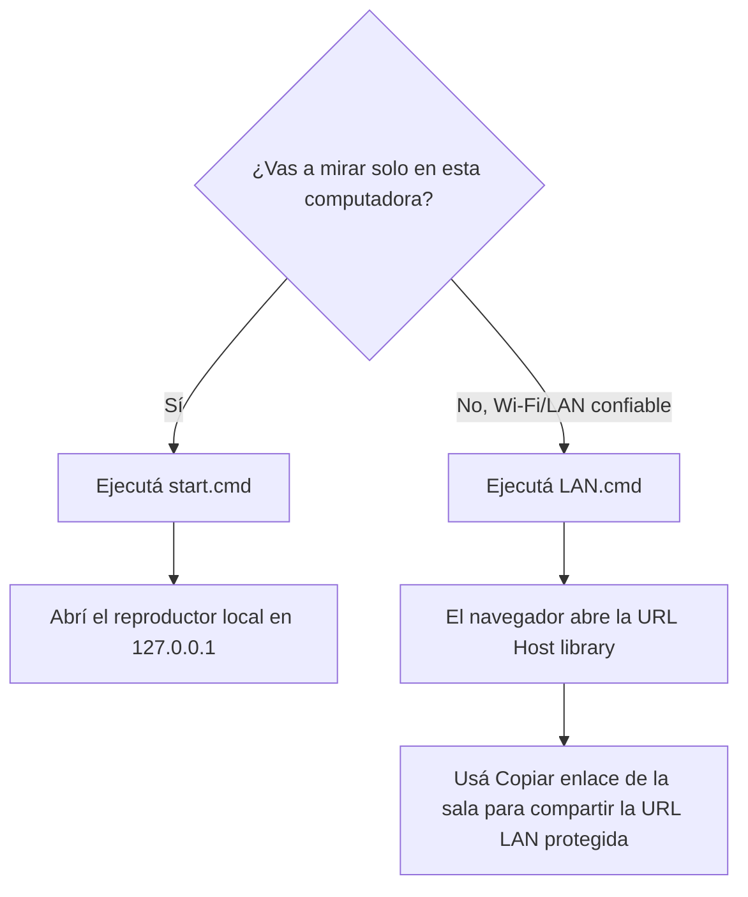

# The Player

[English](README.md)

The Player es un reproductor de video en el navegador para una playlist local. Recuerda el progreso en tu navegador y, opcionalmente, puede crear una sala temporal compartida en una LAN confiable.

## Descarga e inicio

**Portátil de Windows v1.5.2** — [descargá el ZIP](https://github.com/Dortecx/The-Player/releases/download/v1.5.2/The-Player-1.5.2-windows.zip), descomprimilo y abrí la carpeta extraída `The-Player-1.5.2-windows`.


```mermaid
flowchart TD
    A{¿Vas a mirar solo en esta computadora?}
    A -->|Sí| B[Ejecutá start.cmd]
    B --> C[Abrí el reproductor local en 127.0.0.1]
    A -->|No, Wi-Fi/LAN confiable| D[Ejecutá LAN.cmd]
    D --> E[El navegador abre la URL Host library]
    E --> F[Usá Copiar enlace de la sala para compartir la URL LAN protegida]
```

- `start.cmd` es **solo local**: usalo para archivos que quedan en este navegador.
- `LAN.cmd` inicia explícitamente el **modo compartido**: usalo solo si el host y los clientes están en la misma Wi-Fi/LAN confiable.
- El ZIP incluye `runtime\node.exe`; quienes usan el paquete no necesitan Node.js, npm ni `npm install`.

## Reproducción local

1. Ejecutá `start.cmd`.
2. Elegí **Carpeta** o **Archivo** en la página del navegador.
3. Elegí un elemento de la playlist y miralo. El progreso, el estado visto y la actividad reciente quedan en IndexedDB del navegador.

Usá Anterior, Saltar siguiente y Marcar visto y seguir para navegar. Buscar filtra la playlist visible sin cambiar el orden de reproducción. Las extensiones soportadas son `.mp4`, `.webm`, `.m4v`, `.mov` y `.mkv` con soporte limitado; la reproducción depende de los códecs que soporte el navegador.

## Compartir por LAN

1. En el host, ejecutá `LAN.cmd` y permití Node en el Firewall de Windows para redes **privadas** si aparece el aviso.
2. El navegador abre automáticamente la **Host library URL** con token (`127.0.0.1`); ahí elegí archivos o una carpeta.
3. Usá el control **Copiar enlace de la sala** de la app para copiar la URL canónica protegida de sala LAN y enviásela a los clientes sin modificarla.
4. Los clientes abren esa URL copiada desde la misma Wi-Fi/LAN y pueden seleccionar, reproducir, pausar, buscar y navegar juntos.

El token es un secreto de portador: no publiques la URL completa. Esto no es para compartir por Internet. Los invitados no pueden subir ni vaciar la biblioteca del host, y los archivos compartidos temporales se eliminan al detener normalmente el servidor.

Para el comportamiento y los límites de subida, los permisos de host/invitado, los gestos móviles a pantalla completa y la lista de validación en dos navegadores, consultá [los detalles de reproducción compartida por LAN](docs/lan-shared-playback.es.md).

## Límites

- La reproducción compartida es directa en el navegador: no hay transcodificación, remux, subtítulos, descubrimiento por QR ni relay por Internet.
- Cada cliente debe soportar el contenedor **y los códecs** del archivo elegido.
- El límite predeterminado de subida compartida es 100 GiB por archivo; consultá los [detalles LAN](docs/lan-shared-playback.es.md#ciclo-de-carga-y-límites) para cambiarlo antes de iniciar.

## Ejecutar desde el código fuente o crear el ZIP portátil

Para un checkout de código fuente, instalá Node.js 18+ y npm:

```bash
git clone https://github.com/Dortecx/The-Player.git
cd The-Player
npm run web
```

El servidor desde código fuente es solo local de forma predeterminada. Para compartir, iniciá con `SHARE_LAN=1` (`set "SHARE_LAN=1" && npm run web` en Windows Command Prompt, `$env:SHARE_LAN = '1'; npm run web` en PowerShell, o `SHARE_LAN=1 npm run web` en Linux/WSL).

Para crear el ZIP portátil de Windows en Windows:

```powershell
npm run build:portable:win
```

Esto crea `portable-win\The-Player-1.5.2-windows.zip`. El ZIP del release y el ZIP generado incluyen `start.cmd` (solo local) y `LAN.cmd` (modo compartido).

Repositorio: <https://github.com/Dortecx/The-Player> · Release: <https://github.com/Dortecx/The-Player/releases/tag/v1.5.2>

## Licencia

Licencia MIT. Ver [LICENSE](LICENSE).
