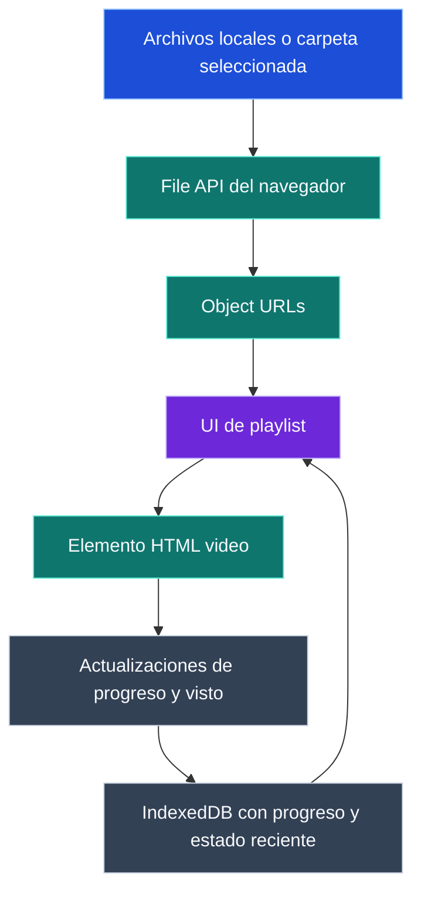

# The Player

[English](README.md)

The Player es un reproductor local de video, amigable para uso portátil, que corre en el navegador, reproduce archivos locales como lista y recuerda el progreso localmente.

## Funciones

- Descargá el ZIP portátil de Windows, descomprimilo y ejecutá `start.cmd` para reproducción local sin `npm install`.
- Seleccioná una carpeta o varios archivos de video y reproducilos en una lista determinística.
- Avanzá por los videos con controles de Anterior, Saltar siguiente, Marcar visto y seguir, y atajos de teclado.
- Buscá dentro de la playlist visible sin cambiar el orden de reproducción, el progreso guardado ni el video activo; las playlists largas quedan acotadas y scrollean internamente.
- Mantené la pantalla despierta durante la reproducción cuando el navegador soporte Screen Wake Lock.
- Recordá progreso, estado visto, último video activo y actividad reciente en IndexedDB del navegador.
- Usá inglés por defecto y español automáticamente cuando el idioma del navegador/sistema sea `es` o `es-*`.
- Mantené la reproducción local como predeterminada; opcionalmente subí los medios elegidos a una sala LAN temporal protegida por token.
- Publicado bajo licencia MIT.

## Requisitos

- Release portátil de Windows: no hace falta instalar Node.js ni npm. El ZIP incluye `runtime\node.exe`.
- Checkout de código fuente o build portátil: Node.js 18 o posterior y npm.
- Un navegador compatible con reproducción directa de medios.
- Para compartir por LAN: host y clientes en la misma Wi-Fi/LAN, más una regla de Firewall de Windows que permita el servidor Node en redes privadas.

## Elegí tu instalación

Elegí el camino según lo que quieras hacer. La mayoría de los usuarios de Windows deberían empezar con el ZIP descargable del release.

Repositorio: <https://github.com/Dortecx/The-Player>

Release v1.5.0: <https://github.com/Dortecx/The-Player/releases/tag/v1.5.0>

### Descargar y ejecutar el portátil de Windows

Usá este camino si querés el paquete de Windows listo para ejecutar. No necesitás Node.js, npm ni `npm install` para esta opción.

1. Descargá el ZIP:

   <https://github.com/Dortecx/The-Player/releases/download/v1.5.0/The-Player-1.5.0-windows.zip>

2. Descomprimilo.
3. Abrí la carpeta extraída `The-Player-1.5.0-windows`.
4. Hacé doble clic en `start.cmd` para reproducción local o en `LAN.cmd` para compartir por LAN.
5. Para reproducción local, usá la ventana del navegador que se abre en <http://127.0.0.1:3000/>. En modo LAN, el lanzador abre la URL localhost tokenizada del host e imprime una URL protegida independiente para compartir con invitados.

El release portátil incluye `runtime\node.exe`, los archivos de la app y los lanzadores `start.cmd` (solo local) y `LAN.cmd` (modo compartido). No requiere `node_modules`, metadatos de Git ni un entorno local de desarrollo.

### Crear y ejecutar el portátil de Windows

Usá este camino si querés crear el mismo ZIP portátil desde un checkout de código fuente en Windows.

```powershell
git clone https://github.com/Dortecx/The-Player.git
cd The-Player
npm run build:portable:win
```

Crealo en Windows con Node.js 18 o posterior disponible en el `PATH`. El build genera:

```text
portable-win\The-Player-1.5.0-windows.zip
```

Descomprimí ese archivo y ejecutá `The-Player-1.5.0-windows\start.cmd` para uso local o `The-Player-1.5.0-windows\LAN.cmd` para compartir. El ZIP portátil generado incluye `runtime\node.exe`, así que los usuarios finales del ZIP no necesitan Node.js ni npm.

### Código fuente en Windows

Usá este camino si querés ejecutar la app directamente desde el repositorio en Windows.

```powershell
git clone https://github.com/Dortecx/The-Player.git
cd The-Player
npm run web
```

Abrí la URL local impresa, normalmente <http://127.0.0.1:3000/>. El checkout de código fuente requiere Node.js 18 o posterior. La app actual no tiene un paso de instalación de dependencias de producción, pero npm se usa para ejecutar scripts.

### Código fuente en WSL/Linux

Usá este camino si querés ejecutar la app desde un checkout de código fuente en WSL o Linux.

```bash
git clone https://github.com/Dortecx/The-Player.git
cd The-Player
npm run web
```

Abrí la URL local impresa, normalmente <http://127.0.0.1:3000/>. El uso desde código fuente requiere Node.js 18 o posterior, npm y un navegador compatible disponible en tu entorno.

## Cómo funciona

The Player sirve una aplicación web local. La reproducción usa archivos locales del navegador y object URLs, mientras que el estado persistente queda en IndexedDB.


```mermaid
flowchart TD
    A[Archivos locales o carpeta seleccionada] --> B[File API del navegador]
    B --> C[Object URLs]
    C --> D[UI de playlist]
    D --> E[Elemento HTML video]
    E --> F[Actualizaciones de progreso y visto]
    F --> G[IndexedDB con progreso y estado reciente]
    G --> D

    classDef input fill:#1d4ed8,stroke:#93c5fd,color:#f8fafc,stroke-width:1px
    classDef browser fill:#0f766e,stroke:#5eead4,color:#f8fafc,stroke-width:1px
    classDef ui fill:#6d28d9,stroke:#c4b5fd,color:#f8fafc,stroke-width:1px
    classDef state fill:#334155,stroke:#cbd5e1,color:#f8fafc,stroke-width:1px

    class A input
    class B,C,E browser
    class D ui
    class F,G state
```

De forma predeterminada, el servidor Node se enlaza solo a `127.0.0.1` y los bytes elegidos quedan en el navegador mediante la File API. Con `SHARE_LAN=1` se enlaza a la LAN e imprime URLs de sala protegidas por token. En esa sala, los medios elegidos se copian a una sesión temporal del servidor y se transmiten directamente a los clientes; los estados de preparación, porcentaje, bytes transferidos/totales, listo y error quedan dentro del panel Playlist. Sin elementos ni una subida activa, el título Playlist y las acciones Carpeta/Archivo quedan centrados verticalmente; al iniciar una subida pasan al encabezado fijo. La primera subida queda centrada en el área útil del panel cuando la sala no tiene medios listos y entra durante 2,5 segundos mediante fragmentos chicos cuadrados/de bloques, claramente visibles y aleatorios. Cuando queda listo el primer elemento, representaciones iguales del centro y del pie fijo hacen un crossfade sincronizado de 3 segundos con el mismo valor continuo, por lo que la lista se vuelve utilizable sin salto físico. Las subidas posteriores entran directo al pie fijo centrado con la misma entrada aleatoria de píxeles chicos de 2,5 segundos mientras solo la lista hace scroll. El progreso real de bytes de XHR mueve el relleno continuamente en toda la tanda seleccionada, incluido el ordinal de cada archivo, sin reiniciarse entre archivos secuenciales. Al completar, el pie usa una salida aleatoria de bloques/píxeles chicos de 2,5 segundos y libera el espacio reservado de la lista solo después de que termina esa salida. Estas transiciones visuales se desactivan cuando se prefiere movimiento reducido. Cada archivo terminado se agrega inmediatamente a la playlist autoritativa de la sala, por lo que queda visible y seleccionable mientras se copian los siguientes; una nueva selección no reemplaza los medios existentes ni el estado de reproducción compartido. El servidor calcula una identidad SHA-256 del contenido durante la copia, separada del ID aleatorio de cada medio de sesión. Selección, reproducción, pausa, búsqueda y navegación se sincronizan a la velocidad fija de 1×. El volumen, silencio, pantalla completa, wake lock y preferencias visuales quedan locales; el progreso de invitados nunca cambia la posición de la sala. Los archivos temporales se eliminan al detener normalmente el servidor.

## Reproducción compartida por LAN

Usala solo en una red local confiable; no es para Internet. El límite predeterminado por archivo es **50 GiB** (`53687091200` bytes). Antes de iniciar, `MAX_UPLOAD_BYTES` admite un entero positivo de bytes para cambiarlo.

1. Iniciá el modo compartido explícitamente: `LAN.cmd` en el paquete portátil, `SHARE_LAN=1 npm run web` en Linux/WSL, o `set "SHARE_LAN=1" && npm run web` en Command Prompt.
2. En la PC host, abrí la **Host library URL** impresa: `http://127.0.0.1:3000/?token=...`. Solo esa URL localhost tokenizada puede elegir Carpeta/Archivo o vaciar la biblioteca. Cada archivo listo se agrega de inmediato a la playlist compartida existente, sin reemplazar sus medios ni su estado de reproducción; Vaciar es la acción global separada que elimina toda la biblioteca de la sala y reinicia la reproducción compartida. Abrir una URL con IP LAN incluso desde la PC host es una sesión invitada.
3. Compartí una de las URLs LAN impresas con los invitados. Conservá `?token=...`: el token permite acceder a los medios y a los comandos de reproducción hasta que el servidor se detenga.
4. Los invitados pueden seleccionar, reproducir, pausar, buscar y navegar, pero Carpeta, Archivo y Vaciar muestran un aviso y no abren el selector ni modifican la biblioteca. El servidor también rechaza esas mutaciones: decide el rol solo con el token y la dirección TCP real de loopback (`127/8`, `::1` o loopback IPv4 mapeado), nunca con `Host`, `Origin` o encabezados reenviados.

### Gestos móviles a pantalla completa

Los gestos a pantalla completa aplican a toques directos sobre el fondo seguro del cuadro de video o del dock de controles, nunca a botones ni rangos. El botón de pantalla completa, `F` y un doble toque fuera de pantalla completa siempre piden primero pantalla completa de elemento para el cuadro de video; la app usa su alternativa inmersiva CSS solo si esa petición no está disponible, se rechaza o se confirma que falla. En pantalla completa, un movimiento vertical en el tercio derecho se clasifica solo después de un desplazamiento suficiente, para que el ruido diagonal inicial no decida el gesto antes de tiempo: ajusta continuamente el volumen del video solo en ese dispositivo, en ambas direcciones, y nunca revela controles ni busca. Un toque sin movimiento revela los controles. Tocá dos veces el tercio izquierdo para retroceder 10 segundos o el derecho para avanzar 10 segundos. Cada cliente acumula feedback visible de repeticiones en la misma dirección (`-10`, `-20`… o `+10`, `+20`…); cambiar de dirección reinicia la etiqueta de ese cliente sin alterar el comando compartido de búsqueda. El tercio central alterna reproducir/pausar con un ícono centrado y adaptable, más chico en teléfonos. Los deslizamientos horizontales no tienen acción de reproducción. La superficie de video a pantalla completa desactiva scroll y pinch táctiles para capturar el deslizamiento de forma confiable, mientras los botones y rangos conservan sus interacciones nativas. No hay gesto de brillo. Los gestos no aplican sobre la barra de búsqueda ni la pulsación larga/menú contextual.

En superficies de reproducción anchas, el dock usa el margen horizontal disponible para mantener la búsqueda y los controles en una sola fila; vuelve a dos filas compactas solo cuando ese espacio realmente no alcanza. Si a un cliente remoto compartido le bloquean el autoplay audible, continúa en silencio para que el video compartido no se desincronice. Un prompt sutil sobre toda la superficie pide tocar cualquier parte para activar el audio de ese cliente; el toque desmutea solo el video local, sin cambiar la reproducción compartida ni el audio del sistema.

### Límites de validación manual

No hay runner de navegador en este proyecto. En dos navegadores o dispositivos, verificá que un host localhost tokenizado pueda subir/limpiar, que una sesión LAN invitada no pueda hacerlo pero sí controlar la reproducción, y que ambos converjan en selección, play/pausa, búsqueda y navegación a la velocidad fija de 1×. Subí varios videos pequeños y confirmá que el panel Playlist centra la primera subida con fragmentos chicos cuadrados/de bloques aleatorios claramente visibles durante 2,5 segundos cuando no hay medios listos, hace un crossfade sincronizado de 3 segundos de ese mismo progreso continuo al pie centrado fijo apenas queda listo el primer elemento, y deja la lista utilizable sin salto físico. Confirmá que las subidas posteriores entren directo al pie con la misma entrada aleatoria de píxeles chicos de 2,5 segundos mientras solo la lista hace scroll, y que al terminar libere ese espacio recién después de una salida aleatoria de bloques/píxeles chicos de 2,5 segundos. Repetí la revisión visual con movimiento reducido activado y confirmá que las transiciones estén desactivadas. Confirmá que cada archivo listo aparece y se puede seleccionar en ambos clientes mientras continúan las otras copias, que las nuevas selecciones se agregan sin reemplazar la biblioteca ni el estado compartido, y que el relleno de progreso por bytes reales de XHR avanza sin reiniciarse entre archivos. Confirmá que Vaciar siga eliminando globalmente toda la sala. En móvil, confirmá que el botón de pantalla completa, `F` y un doble toque fuera de pantalla completa primero pidan pantalla completa de elemento para el cuadro; solo una petición no disponible, rechazada o fallida puede usar la alternativa CSS de la app a `100dvh`. Salí con el botón o Escape. Tocá dos veces los tercios izquierdo/derecho/central y verificá que los saltos compartidos de 10 segundos y play/pausa converjan en el otro cliente; cada cliente debe acumular repeticiones en la misma dirección a `-20`/`+20`, y cambiar de dirección reinicia la etiqueta de ese cliente. Deslizá verticalmente el fondo del cuadro de video del tercio derecho hacia arriba y abajo durante un mismo arrastre capturado, y verificá que el volumen local y su feedback sigan el valor actual continuamente; los deslizamientos horizontales no deben activar reproducción. Confirmá que la superficie a pantalla completa suprima pinch/scroll, mientras que la pulsación larga/menú contextual y la barra de búsqueda no se vean afectados. Confirmá que los controles sigan accesibles por toque y teclado.

## Uso

1. Iniciá The Player con `start.cmd` portátil para reproducción local, `LAN.cmd` portátil para compartir, o con `npm run web` desde un checkout de código fuente.
2. Abrí la página local en el navegador si no se abre automáticamente.
3. Elegí `Carpeta` para cargar una carpeta, o `Archivo` para seleccionar uno o más videos.
4. Seleccioná un elemento de la playlist, o dejá que la app elija el elemento significativo más reciente desde el estado local guardado.
5. Mirá videos con controles oscuros personalizados o con atajos de teclado. Cuando el navegador lo admite, la pantalla completa usa pantalla completa real de elemento para el cuadro de video y sus controles; si no, usa un modo inmersivo alternativo controlado por la app para ese mismo cuadro. En el modo alternativo, la interfaz del navegador sigue bajo control del navegador.
6. Usá `Saltar siguiente` para guardar el progreso actual y avanzar sin marcar el elemento como visto.
7. Usá `Marcar visto y seguir` para completar el elemento actual y avanzar.
8. Usá `Buscar playlist` para filtrar visualmente la lista; la reproducción y Anterior/Saltar siguiente siguen usando el orden completo de la playlist.
9. Usá `Vaciar` para limpiar la playlist actual sin borrar el progreso guardado.

Durante la reproducción, los navegadores compatibles pueden mantener la pantalla despierta. El wake lock se libera al pausar, terminar el video, vaciar la lista o esconder/cerrar la página.

Atajos de teclado:

- `Space`: alternar reproducir/pausar
- `ArrowLeft` / `ArrowRight`: retroceder/avanzar 5 segundos
- `A` / `D`: video anterior / saltar al siguiente sin marcar visto
- `W`: marcar visto y reproducir el siguiente
- `F`: alternar pantalla completa
- `ArrowUp` / `ArrowDown`: subir/bajar volumen de a 5 %

Los atajos se ignoran mientras escribís en campos o enfocás botones/controles de la interfaz.

Extensiones de archivo soportadas:

- `.mp4`
- `.webm`
- `.m4v`
- `.mov`
- `.mkv` best-effort

La reproducción real y Screen Wake Lock dependen del soporte del navegador. El soporte de MKV es limitado en muchos navegadores. The Player todavía no remuxa, transcodifica ni extrae subtítulos.

## Compatibilidad de plataforma

El portátil de Windows está soportado mediante el release ZIP v1.5.0 y el script de build portátil para Windows. El uso desde código fuente funciona donde haya Node.js 18 o posterior, npm y un navegador compatible. La reproducción siempre depende de los codecs soportados por el navegador que abre la app local.

## Licencia

Licencia MIT. Ver [LICENSE](LICENSE).
