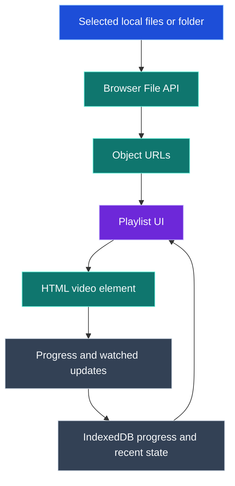

# The Player

[Español](README.es.md)

The Player is a portable-friendly local video player that runs in your browser, plays selected local files as a playlist, and remembers progress locally.

## Features

- Download the Windows portable release ZIP, unzip it, and run `start.cmd` with no `npm install`.
- Select a folder or multiple video files and play them in a deterministic playlist.
- Continue through videos with Previous, Skip next, Mark watched & next controls, and keyboard shortcuts.
- Search the visible playlist without changing playback order, saved progress, or the active video; large playlists stay bounded and scroll internally.
- Keep the screen awake during playback when the browser supports Screen Wake Lock.
- Remember progress, watched state, last active video, and recent activity in the browser's IndexedDB.
- Use English by default and Spanish automatically when the browser/system language is `es` or `es-*`.
- Keep video files local in the browser; selected files are not uploaded to the Node server.
- Released under the MIT License.

## Requirements

- Windows portable release: no Node.js or npm installation is required. The ZIP includes `runtime\node.exe`.
- Source checkout or portable build: Node.js 18 or later and npm.
- A compatible browser with local media playback support.

## Choose your setup

Pick the path that matches what you want to do. Most Windows users should start with the downloadable release ZIP.

Repository: <https://github.com/Dortecx/The-Player>

Release v1.3.0: <https://github.com/Dortecx/The-Player/releases/tag/v1.3.0>

### Windows portable download/run

Use this when you want the ready-to-run Windows package. You do not need Node.js, npm, or `npm install` for this path.

1. Download the ZIP:

   <https://github.com/Dortecx/The-Player/releases/download/v1.3.0/The-Player-1.3.0-windows.zip>

2. Unzip it.
3. Open the extracted `The-Player-1.3.0-windows` folder.
4. Double-click `start.cmd`.
5. Use the browser window that opens at <http://127.0.0.1:3000/>.

The portable release includes `runtime\node.exe`, the app files, and the launcher. It does not require `node_modules`, Git metadata, or a local development environment.

### Windows portable build/run

Use this when you want to build the same portable ZIP from a Windows source checkout.

```powershell
git clone https://github.com/Dortecx/The-Player.git
cd The-Player
npm run build:portable:win
```

Build this on Windows with Node.js 18 or later available on `PATH`. The build creates:

```text
portable-win\The-Player-1.3.0-windows.zip
```

Unzip that file and run `The-Player-1.3.0-windows\start.cmd`. The generated portable ZIP includes `runtime\node.exe`, so end users of the ZIP do not need Node.js or npm.

### Windows source checkout

Use this when you want to run the app directly from the repository on Windows.

```powershell
git clone https://github.com/Dortecx/The-Player.git
cd The-Player
npm run web
```

Open the printed local URL, usually <http://127.0.0.1:3000/>. The source checkout requires Node.js 18 or later. The current app has no production dependency install step, but npm is still used to run scripts.

### WSL/Linux source checkout

Use this when you want to run the app from a WSL or Linux source checkout.

```bash
git clone https://github.com/Dortecx/The-Player.git
cd The-Player
npm run web
```

Open the printed local URL, usually <http://127.0.0.1:3000/>. Source checkout usage requires Node.js 18 or later, npm, and a compatible browser available to your environment.

## How it works

The Player serves a local web app. Playback uses browser-local file handles and object URLs, while persistent state stays in IndexedDB.



The Node server only serves the static app over localhost. Selected video bytes stay in the browser through the File API. Progress, watched state, exact selected-set activity, and recent per-file activity are stored in IndexedDB so reselecting files can restore the most relevant video.

## Usage

1. Start The Player with the Windows portable `start.cmd` or with `npm run web` from a source checkout.
2. Open the local browser page if it does not open automatically.
3. Choose `Folder` to load a folder, or `File` to select one or more video files.
4. Select a playlist item, or let the app choose the most recent meaningful item from saved local state.
5. Watch videos with the custom dark controls or keyboard shortcuts. Fullscreen targets only the video frame and its controls.
6. Use `Skip next` to save current progress and move on without marking the item watched.
7. Use `Mark watched & next` to complete the current item and advance.
8. Use `Search playlist` to visually filter the list; playback and Previous/Skip next still use the full playlist order.
9. Use `Clear` to empty the current playlist without deleting saved progress.

During playback, supported browsers may keep the screen awake. The wake lock is released on pause, ended playback, clearing the list, or when the page is hidden/closed.

Keyboard shortcuts:

- `Space`: play/pause toggle
- `ArrowLeft` / `ArrowRight`: seek backward/forward 5 seconds
- `A` / `D`: previous video / skip next without marking watched
- `W`: mark watched and play next
- `F`: toggle fullscreen
- `ArrowUp` / `ArrowDown`: volume up/down by 5%

Shortcuts are ignored while typing in fields or focusing UI buttons/controls.

Supported file extensions:

- `.mp4`
- `.webm`
- `.m4v`
- `.mov`
- `.mkv` best-effort

Actual playback and Screen Wake Lock support depend on browser capabilities. MKV support is limited in many browsers. The Player does not remux, transcode, or extract subtitles yet.

## Platform support

Windows portable is supported through the v1.3.0 ZIP release and the Windows portable build script. Source checkout usage works where Node.js 18 or later, npm, and a compatible browser are available. Playback always depends on the codecs supported by the browser that opens the local app.

## License

MIT License. See [LICENSE](LICENSE).
