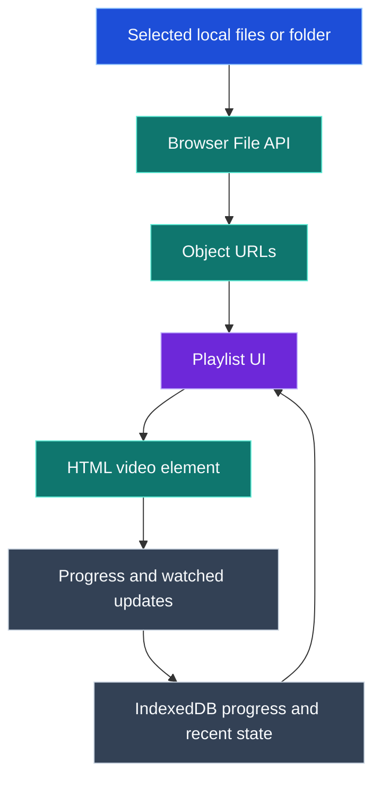

# The Player

[Español](README.es.md)

The Player is a portable-friendly local video player that runs in your browser, plays selected local files as a playlist, and remembers progress locally.

## Features

- Download the Windows portable release ZIP, unzip it, and run `start.cmd` for local-only playback with no `npm install`.
- Select a folder or multiple video files and play them in a deterministic playlist.
- Continue through videos with Previous, Skip next, Mark watched & next controls, and keyboard shortcuts.
- Search the visible playlist without changing playback order, saved progress, or the active video; large playlists stay bounded and scroll internally.
- Keep the screen awake during playback when the browser supports Screen Wake Lock.
- Remember progress, watched state, last active video, and recent activity in the browser's IndexedDB.
- Use English by default and Spanish automatically when the browser/system language is `es` or `es-*`.
- Keep local-only playback as the default; optionally upload selected media into a temporary, token-protected LAN shared room.
- Released under the MIT License.

## Requirements

- Windows portable release: no Node.js or npm installation is required. The ZIP includes `runtime\node.exe`.
- Source checkout or portable build: Node.js 18 or later and npm.
- A compatible browser with direct media playback support.
- For LAN sharing: host and clients on the same Wi-Fi/LAN, plus a Windows Firewall rule that allows the selected Node server on Private networks.

## Choose your setup

Pick the path that matches what you want to do. Most Windows users should start with the downloadable release ZIP.

Repository: <https://github.com/Dortecx/The-Player>

Release v1.5.0: <https://github.com/Dortecx/The-Player/releases/tag/v1.5.0>

### Windows portable download/run

Use this when you want the ready-to-run Windows package. You do not need Node.js, npm, or `npm install` for this path.

1. Download the ZIP:

   <https://github.com/Dortecx/The-Player/releases/download/v1.5.0/The-Player-1.5.0-windows.zip>

2. Unzip it.
3. Open the extracted `The-Player-1.5.0-windows` folder.
4. Double-click `start.cmd` for local-only playback, or `LAN.cmd` to explicitly enable LAN sharing.
5. For local-only playback, use the browser window that opens at <http://127.0.0.1:3000/>. In LAN mode, the launcher opens the host's tokenized loopback URL and prints a separate protected guest URL to share with LAN devices.

The portable release includes `runtime\node.exe`, the app files, and the `start.cmd` (local-only) and `LAN.cmd` (shared-mode) launchers. It does not require `node_modules`, Git metadata, or a local development environment.

### Windows portable build/run

Use this when you want to build the same portable ZIP from a Windows source checkout.

```powershell
git clone https://github.com/Dortecx/The-Player.git
cd The-Player
npm run build:portable:win
```

Build this on Windows with Node.js 18 or later available on `PATH`. The build creates:

```text
portable-win\The-Player-1.5.0-windows.zip
```

Unzip that file and run `The-Player-1.5.0-windows\start.cmd` for local playback or `The-Player-1.5.0-windows\LAN.cmd` for sharing. The generated portable ZIP includes `runtime\node.exe`, so end users of the ZIP do not need Node.js or npm.

### Windows source checkout

Use this when you want to run the app directly from the repository on Windows.

```powershell
git clone https://github.com/Dortecx/The-Player.git
cd The-Player
npm run web
```

Open the printed local URL, usually <http://127.0.0.1:3000/>. To explicitly enable LAN sharing, run `set "SHARE_LAN=1" && npm run web` in Command Prompt or `$env:SHARE_LAN = '1'; npm run web` in PowerShell; use one of the printed protected room URLs, not the loopback URL. The source checkout requires Node.js 18 or later. The current app has no production dependency install step, but npm is still used to run scripts.

### WSL/Linux source checkout

Use this when you want to run the app from a WSL or Linux source checkout.

```bash
git clone https://github.com/Dortecx/The-Player.git
cd The-Player
npm run web
```

Open the printed local URL, usually <http://127.0.0.1:3000/>. To explicitly enable LAN sharing, run `SHARE_LAN=1 npm run web`; use one of the printed protected room URLs, not the loopback URL. Source checkout usage requires Node.js 18 or later, npm, and a compatible browser available to your environment.

## How it works

The Player serves a local web app. Playback uses browser-local file handles and object URLs, while persistent state stays in IndexedDB.


```mermaid
flowchart TD
    A[Selected local files or folder] --> B[Browser File API]
    B --> C[Object URLs]
    C --> D[Playlist UI]
    D --> E[HTML video element]
    E --> F[Progress and watched updates]
    F --> G[IndexedDB progress and recent state]
    G --> D

    classDef input fill:#1d4ed8,stroke:#93c5fd,color:#f8fafc,stroke-width:1px
    classDef browser fill:#0f766e,stroke:#5eead4,color:#f8fafc,stroke-width:1px
    classDef ui fill:#6d28d9,stroke:#c4b5fd,color:#f8fafc,stroke-width:1px
    classDef state fill:#334155,stroke:#cbd5e1,color:#f8fafc,stroke-width:1px

    class A input
    class B,C,E browser
    class D ui
    class F,G state
```

By default, the Node server binds only to `127.0.0.1`; selected video bytes stay in the browser through the File API. When started with `SHARE_LAN=1` (or `LAN.cmd` in the portable package), it binds to the LAN and prints one canonical protected room URL at the actual bound port. It prefers normal physical Ethernet/Wi-Fi adapters over virtual, WSL, Docker, Hyper-V, or VPN-like adapters, and uses the tokenized loopback URL only as a safe fallback when no usable LAN IPv4 address is available. The protected session metadata supplies this canonical URL to the browser clipboard control; it never rebuilds a share link from the browser address. In that room, selected files are first copied to a temporary server session, then streamed directly to clients; upload preparing, percentage, transferred/total bytes, ready, and errors remain in the Playlist panel. With no items and no active upload, the Playlist title and Folder/File actions are vertically centered; starting an upload moves them into the fixed header. The first upload is centered in the usable panel area when the room has no ready media and enters over 2.5 seconds through clearly visible, randomized small square/block fragments. When its first item becomes ready, matching center and fixed-footer representations crossfade together for a synchronized 3 seconds with the same continuous batch value, so the list becomes usable without a physical jump. Later uploads enter the fixed centered footer directly with the same 2.5-second randomized small-pixel entrance while the playlist alone scrolls. Real XHR byte progress drives the fill continuously across the selected batch, including each file's ordinal, without resetting between sequential files. On completion, the footer uses a 2.5-second randomized small-pixel/block exit and releases its reserved list space only after that exit completes. These visual transitions are disabled for reduced-motion preferences. Each finished file is appended to the authoritative room playlist immediately, so it becomes visible and selectable while later files are still copying; a later selection never replaces existing room media or playback state. The server computes a SHA-256 content identity while streaming, separately from each random session media ID. Playback selection, play/pause, seek, and navigation synchronize at the fixed 1× rate. Volume, mute, fullscreen, wake lock, progress, watched state, and visual preferences remain client-local; guest progress never changes the room position. Uploaded files are removed when the server shuts down normally.

## LAN shared playback

Use this only on a trusted local network. It is not Internet sharing.

### Host steps

The per-file upload limit is **50 GiB** (`53687091200` bytes) by default. Set `MAX_UPLOAD_BYTES` to a positive whole-number integer of bytes before starting the server to choose a different cap; do not use decimal values or `GB`/`GiB` suffixes. For example, `MAX_UPLOAD_BYTES=107374182400 SHARE_LAN=1 npm run web` sets a 100 GiB cap on Linux/WSL. On Windows PowerShell use `$env:MAX_UPLOAD_BYTES = '107374182400'` before the share command. The startup output prints the effective `MAX_UPLOAD_BYTES` value and its GiB equivalent. Changing the variable does not affect a running listener: stop the current listener, then restart the intended server with the new value. The server validates this cap before accepting uploads and continues to stream uploads to temporary files with partial-file cleanup on rejected, oversized, or aborted transfers.

1. Put the host and every client on the same Wi-Fi/LAN. Do not use guest Wi-Fi/client isolation.
2. Start shared mode explicitly: run `LAN.cmd` in the portable package, `SHARE_LAN=1 npm run web` on Linux/WSL, `set "SHARE_LAN=1" && npm run web` in Windows Command Prompt, or `$env:SHARE_LAN = '1'; npm run web` in PowerShell.
3. Allow the Node server through Windows Firewall on **Private** networks when Windows prompts. If clients cannot connect, confirm the host firewall permits inbound TCP port `3000` on the private LAN.
4. Open the printed **Host library URL** (`http://127.0.0.1:3000/?token=...`) on the host. Select a folder or files there; each file is visibly prepared and copied to the temporary room session before it becomes available to clients. Each ready file appends to the existing shared playlist immediately, so clients may select it while later files continue uploading. Clear is the separate global action that removes the complete room library and resets shared playback. A LAN-IP room URL opened on the host PC is intentionally a guest session.
5. Share the printed canonical LAN room URL with clients. After joining the valid room, use the compact clipboard button in the page header to copy the server-provided canonical room URL; the bearer URL is never displayed in the page UI.

### Client steps

1. Join the same Wi-Fi/LAN as the host.
2. Open the exact protected room URL from the host. Do not remove its `?token=...` value.
3. Wait for the playlist to load, then use selection, play/pause, seek, Previous, or Skip next. Those controls synchronize for all connected clients at the fixed 1× rate.

The room token is a bearer secret: anyone who has the full URL can view uploaded media and control the room until the host stops the server. Do not post it publicly. Only a tokenized request whose real TCP peer is loopback (`127/8`, `::1`, or IPv4-mapped loopback) can upload, replace, or clear the library; the server does not trust `Host`, `Origin`, or forwarded headers for that decision. Guests can still use all shared playback and media controls. Files are temporary and are deleted on ordinary server shutdown; closing a browser tab does not delete them.

### Mobile fullscreen gestures

Fullscreen gestures apply to direct touches on the safe video-frame or control-dock background, never buttons or ranges. The fullscreen button, `F`, and a non-fullscreen double-tap always request element fullscreen for the video frame first; the app uses its CSS immersive fallback only when that request is unavailable, rejected, or confirmed to fail. In fullscreen, a right-third vertical movement is classified only after sufficient movement, so initial diagonal noise does not prematurely decide a gesture; it continuously adjusts only this device's video volume in either direction and never reveals controls or seeks. A stationary tap reveals controls. Double-tap the left third to seek back 10 seconds or the right third to seek forward 10 seconds. Every client accumulates visible repeated same-direction feedback (`-10`, `-20`… or `+10`, `+20`…); changing direction resets that client's label without changing the shared seek command. The center third toggles play/pause with a centered responsive icon that is smaller on phones. Horizontal swipes have no playback meaning. The fullscreen video surface disables touch scrolling and pinch zoom so the swipe is captured reliably while buttons and ranges retain their native interactions. There is no brightness gesture. Gestures do not apply to the seek range or long presses/context menus.

On wider playback surfaces, the dock uses its available horizontal room to keep seek and playback controls on one row; it falls back to the compact two-row layout only when that space is genuinely unavailable. If a remote shared client is blocked from audible autoplay, it continues muted so shared video stays synchronized. A subtle full-surface prompt asks the viewer to tap anywhere to enable that client's audio; the tap unmutes the video locally without changing shared playback or system audio.

Shared playback is direct browser playback only. There is no transcoding, remuxing, subtitle processing, QR discovery, or Internet relay. Each client's browser must support the file container **and its codecs**; an `.mkv`, `.mov`, or even `.mp4` can fail if its codecs are unsupported.

### Manual two-browser validation

1. Start shared mode and open a printed protected room URL in Browser A on the host.
2. Select several small supported videos in Browser A and confirm the Playlist panel centers the initial upload with clearly visible randomized small square/block fragments over 2.5 seconds, then crossfades its identical live progress value to the fixed centered footer for a synchronized 3 seconds as soon as the first item is ready; the list must become usable without a physical jump. Confirm later uploads enter the footer directly with the same 2.5-second randomized small-pixel entrance while only the list scrolls. Confirm each finished file appears in both playlists immediately, remains selectable while later files copy, and that a later selection appends without replacing the existing library or shared playback. Confirm the lifecycle reports preparing through real XHR percentage plus transferred/total bytes to ready with a continuously advancing batch fill, then removes the footer reservation only after its 2.5-second randomized small-pixel/block exit after the final upload. Repeat the visual check with reduced motion enabled and confirm the transitions are disabled. Confirm Clear still globally removes every room item and resets shared playback.
3. Open the same full URL in Browser B (another browser profile, device, or LAN client) and confirm the playlist appears.
4. From each browser in turn, select the video, play, pause, seek, use Previous, and use Skip next; confirm the other browser converges after each action at the fixed 1× rate.
5. Use the compact header clipboard button in either browser, confirm the page-styled top-right success toast appears, and paste the copied URL into a safe test location to confirm it retains the room token without displaying it in the page.
6. On a phone or tablet, test portrait and landscape fullscreen and rotate while it is active. Confirm the fullscreen button, `F`, and a non-fullscreen frame double-tap each first request element fullscreen for the frame; only unavailable, rejected, or failed element requests may use the app-controlled `100dvh` fallback. Exit with the fullscreen button or Escape. In fullscreen, double-tap the left/right/center thirds and confirm shared back/forward 10-second seeks and play/pause converge in the other client; every client must accumulate repeated same-direction feedback to `-20`/`+20`, and a direction change resets that client's label. Vertically swipe the right-third video-frame background upward and downward during one captured drag, and confirm local volume and its feedback track continuously; horizontal swipes must not trigger playback actions. Confirm the fullscreen surface suppresses pinch/scroll while long press/context menu and the seek range remain unaffected. Confirm controls remain usable with touch and keyboard.
7. In a LAN guest session, click Folder, File, and Clear. Confirm each shows the host-only toast without opening a picker or changing the library; then verify the tokenized localhost host session can complete the same library actions.
8. Long-press and open the context menu on the video frame where the browser permits it; confirm the app suppresses those affordances where supported. This is UI hardening only: it does not make streamed media inaccessible to a client that has authorized media access.
9. Stop the server and confirm the temporary session is no longer reachable.

## Usage

1. Start The Player with portable `start.cmd` for local-only playback, portable `LAN.cmd` for sharing, or `npm run web` from a source checkout.
2. Open the local browser page if it does not open automatically.
3. Choose `Folder` to load a folder, or `File` to select one or more video files.
4. Select a playlist item, or let the app choose the most recent meaningful item from saved local state.
5. Watch videos with the custom dark controls or keyboard shortcuts. Fullscreen first uses real element fullscreen for the video frame and its controls where the browser supports it; otherwise it falls back to an app-controlled immersive mode for that same frame. Browser chrome remains browser-controlled in the fallback.
6. Use `Skip next` to save current progress and move on without marking the item watched.
7. Use `Mark watched & next` to complete the current item and advance.
8. Use `Search playlist` to visually filter the list; playback and Previous/Skip next still use the full playlist order.
9. Use `Clear` to empty the current playlist without deleting saved progress.

During playback, supported browsers may keep the screen awake. The wake lock is released on pause, ended playback, clearing the list, or when the page is hidden/closed.

Keyboard shortcuts:

- `Space`: play/pause toggle
- `ArrowLeft` / `ArrowRight`: seek backward/forward 5 seconds
- `A` / `D`: previous video / skip next without marking watched
- `W`: mark watched and play next
- `F`: toggle fullscreen
- `ArrowUp` / `ArrowDown`: volume up/down by 5%

Shortcuts are ignored while typing in fields or focusing UI buttons/controls.

Supported file extensions:

- `.mp4`
- `.webm`
- `.m4v`
- `.mov`
- `.mkv` best-effort

Actual playback and Screen Wake Lock support depend on browser capabilities. MKV support is limited in many browsers. The Player does not remux, transcode, or extract subtitles yet.

## Platform support

Windows portable is supported through the v1.5.0 ZIP release and the Windows portable build script. Source checkout usage works where Node.js 18 or later, npm, and a compatible browser are available. Playback always depends on the codecs supported by the browser that opens the local app.

## License

MIT License. See [LICENSE](LICENSE).
