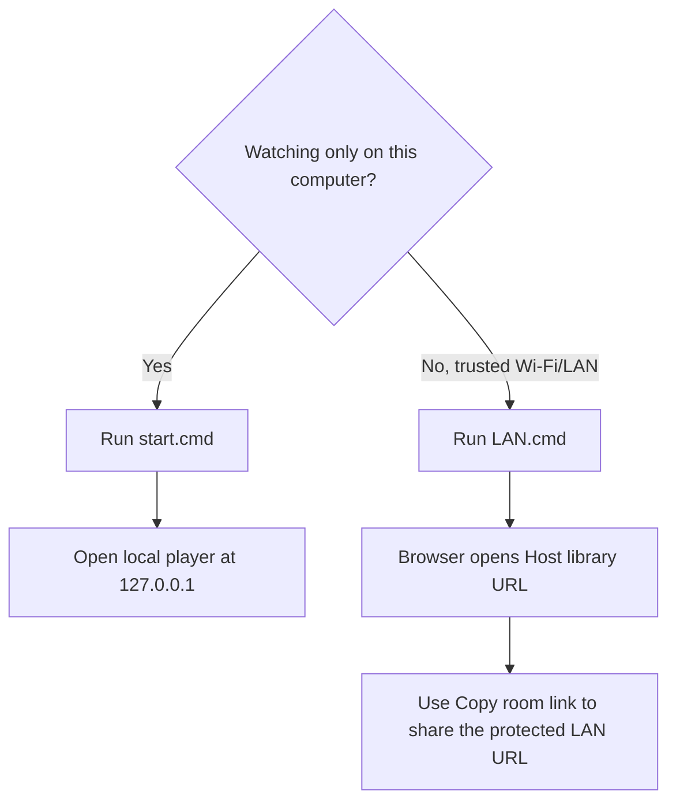

# The Player

[Español](README.es.md)

The Player is a browser-based video player for a local playlist. It remembers progress in your browser and can optionally host a temporary shared room on a trusted LAN.

## Download and start

**Windows portable v1.5.4** — [download the ZIP](https://github.com/Dortecx/The-Player/releases/download/v1.5.4/The-Player-1.5.4-windows.zip), unzip it, then open the extracted `The-Player-1.5.4-windows` folder.


```mermaid
flowchart TD
    A{Watching only on this computer?}
    A -->|Yes| B[Run start.cmd]
    B --> C[Open local player at 127.0.0.1]
    A -->|No, trusted Wi-Fi/LAN| D[Run LAN.cmd]
    D --> E[Browser opens Host library URL]
    E --> F[Use Copy room link to share the protected LAN URL]
```

- `start.cmd` is **local-only**: use it for files that stay in this browser.
- `LAN.cmd` explicitly starts **shared mode**: use it only when the host and clients are on the same trusted Wi-Fi/LAN.
- Each launcher opens the browser automatically after the server is ready and keeps its console as the server lifecycle owner. Close that launcher console to stop its server.
- The ZIP includes `runtime\node.exe`; end users do not need Node.js, npm, or `npm install`.

## Local playback

1. Run `start.cmd`; it opens the local player in your browser automatically.
2. Keep the launcher console open while using the player; closing it stops the local server.
3. Choose **Folder** or **File** in the browser page.
4. Choose a playlist item and watch. Progress, watched state, and recent activity stay in browser IndexedDB.

Use Previous, Skip next, and Mark watched & next to navigate. Search filters the visible playlist without changing playback order. Supported extensions are `.mp4`, `.webm`, `.m4v`, `.mov`, and best-effort `.mkv`; playback depends on browser codec support.

## Share on a LAN

1. On the host, run `LAN.cmd` and allow Node through Windows Firewall on **Private** networks if prompted.
2. The browser opens the tokenized **Host library URL** (`127.0.0.1`) automatically; choose files or a folder there.
3. Keep the launcher console open while the room is in use; closing it stops the shared server and ends the room.
4. Use the in-app **Copy room link** control to copy the canonical protected LAN room URL, then send it to clients unchanged.
5. Clients open that copied URL on the same Wi-Fi/LAN and can select, play, pause, seek, and navigate together.

The token is a bearer secret: do not post the full URL. This is not Internet sharing. Guests cannot upload or clear the host library, and temporary shared files are removed on ordinary server shutdown.

For upload behavior and limits, host/guest permissions, mobile fullscreen gestures, and the two-browser validation checklist, see [LAN shared playback details](docs/lan-shared-playback.md).

## Limits

- Shared playback is direct browser playback: there is no transcoding, remuxing, subtitles, QR discovery, or Internet relay.
- Every client must support the selected file container **and codecs**.
- The default shared upload cap is 100 GiB per file; see the [LAN details](docs/lan-shared-playback.md#upload-lifecycle-and-limits) to change it before startup.

## Run from source or build the portable ZIP

For a source checkout, install Node.js 18+ and npm:

```bash
git clone https://github.com/Dortecx/The-Player.git
cd The-Player
npm run web
```

The source server is local-only by default. To share, start it with `SHARE_LAN=1` (`set "SHARE_LAN=1" && npm run web` in Windows Command Prompt, `$env:SHARE_LAN = '1'; npm run web` in PowerShell, or `SHARE_LAN=1 npm run web` on Linux/WSL).

To build the Windows portable ZIP on Windows:

```powershell
npm run build:portable:win
```

This creates `portable-win\The-Player-1.5.4-windows.zip`. The release ZIP and generated ZIP include both `start.cmd` (local-only) and `LAN.cmd` (shared mode).

Repository: <https://github.com/Dortecx/The-Player> · Release: <https://github.com/Dortecx/The-Player/releases/tag/v1.5.4>

## License

MIT License. See [LICENSE](LICENSE).
