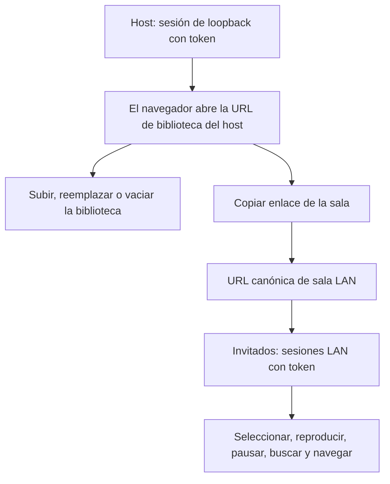
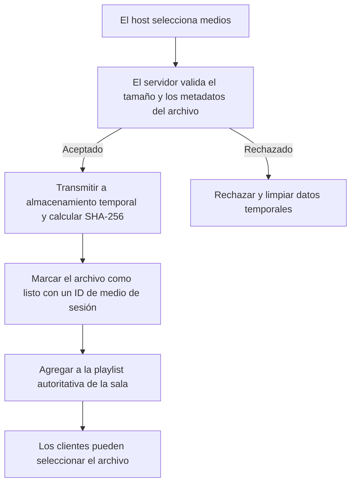
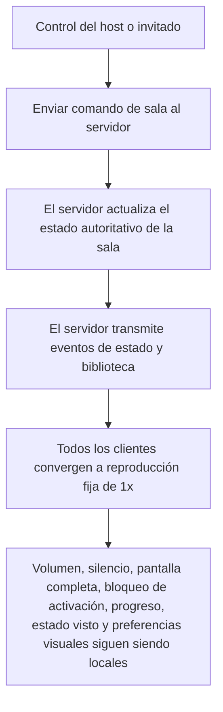

# Detalles de reproducción compartida por LAN

Esta guía complementa el [README en inglés](../README.md) y el [README en español](../README.es.md). Usá la reproducción compartida solo en una red local confiable; no es un servicio para compartir por Internet.

## Roles de host y clientes

Iniciá explícitamente el modo compartido:

- Paquete portátil de Windows: ejecutá `LAN.cmd`.
- Checkout de código fuente en Windows Command Prompt: `set "SHARE_LAN=1" && npm run web`.
- Checkout de código fuente en Windows PowerShell: `$env:SHARE_LAN = '1'; npm run web`.
- Checkout de código fuente en Linux/WSL: `SHARE_LAN=1 npm run web`.

El host y los clientes deben estar en la misma Wi-Fi/LAN, sin aislamiento de clientes de red de invitados. Cuando se solicite, permití el servidor Node a través del Firewall de Windows en redes **privadas**; si hace falta, permití el puerto TCP de entrada `3000` en la LAN privada.

Con el paquete portátil de Windows, `LAN.cmd` espera la URL de biblioteca del host con token y la abre automáticamente en el navegador del host. Mantené abierta la consola del launcher mientras la sala esté en uso: es dueña del ciclo de vida del servidor, así que cerrarla detiene el servidor y termina la sala. Cuando se abra el navegador, usá el control **Copiar enlace de la sala** dentro de la app para copiar la URL canónica protegida de sala LAN para los invitados; el launcher no la imprime.



| URL o control | Uso |
| --- | --- |
| **URL de biblioteca del host** (`127.0.0.1` con `?token=...`) | El launcher portátil la abre solo en el host para agregar medios o vaciar la biblioteca. |
| **Copiar enlace de la sala** | Usalo en la app del host para copiar sin cambios la URL canónica de LAN para invitados. Incluye el token de portador. |

El servidor selecciona una dirección IPv4 física de Ethernet/Wi-Fi utilizable con preferencia sobre adaptadores virtuales, WSL, Docker, Hyper-V o similares a VPN. Si ninguna es utilizable, recurre de forma segura a la URL de loopback con token. El control de portapapeles de la página usa metadatos de sesión proporcionados por el servidor; no reconstruye un enlace compartido a partir de la dirección del navegador.

El token de sala es un secreto de portador: cualquier persona con la URL completa puede ver los medios subidos y controlar la sala hasta que el host detenga el servidor. No lo publiques. Una URL de sala LAN-IP abierta en el host es intencionalmente una sesión de invitado.

Solo una solicitud con token cuyo par TCP real sea loopback (`127/8`, `::1` o loopback mapeado a IPv4) puede subir, reemplazar o vaciar la biblioteca. El servidor no confía en `Host`, `Origin` ni encabezados reenviados para esta decisión. Los invitados pueden usar los controles de reproducción compartida, pero Carpeta, Archivo y Vaciar siguen siendo exclusivos del host.

## Ciclo de carga y límites

El máximo predeterminado es **100 GiB por archivo** (`107374182400` bytes). Antes de iniciar el servidor, configurá `MAX_UPLOAD_BYTES` con un recuento de bytes entero positivo para cambiarlo; los valores decimales y los sufijos `GB`/`GiB` no son válidos.

```bash
MAX_UPLOAD_BYTES=107374182400 SHARE_LAN=1 npm run web
```

El ejemplo establece un límite de 100 GiB en Linux/WSL. En PowerShell, configurá `$env:MAX_UPLOAD_BYTES = '107374182400'` antes del comando de modo compartido. La salida de inicio informa el valor efectivo en bytes y su equivalente en GiB. Una variable modificada no afecta a un listener en ejecución: detenelo e iniciá de nuevo el servidor previsto.

El servidor valida el límite antes de aceptar una carga y transmite las cargas aceptadas a archivos temporales. Las cargas rechazadas, sobredimensionadas, parciales y abortadas se limpian. A cada archivo se le asigna un ID de medio de sesión aleatorio mientras se calcula su identidad de contenido SHA-256 durante la transmisión.



En el panel Playlist del host, los archivos seleccionados avanzan por preparación, porcentaje, bytes transferidos/totales, listo y error. Los archivos listos se agregan de inmediato a la playlist autoritativa de la sala, para que los clientes puedan seleccionarlos mientras los archivos posteriores aún se copian. Una carga posterior nunca reemplaza los medios existentes de la sala ni el estado de reproducción. Vaciar es la acción global independiente que elimina toda la biblioteca de la sala y restablece la reproducción compartida.

Cuando la sala comienza vacía, la primera carga se centra en el área útil del panel. Entra durante 2.5 segundos mediante fragmentos aleatorizados de cuadrados/bloques pequeños; cuando su primer elemento está listo, las representaciones centrada y de pie de página fijo hacen un fundido cruzado sincronizado durante 3 segundos usando el mismo valor continuo de lote. Las cargas posteriores entran directamente en el pie de página centrado con la misma entrada aleatorizada de pequeños píxeles durante 2.5 segundos, mientras solo se desplaza la playlist. El progreso real de bytes de XHR avanza de forma continua sobre el lote seleccionado, incluido el ordinal de cada archivo, sin reiniciarse entre archivos secuenciales. Tras la última carga, se completa una salida aleatorizada de pequeños píxeles/bloques de 2.5 segundos antes de liberar el espacio reservado de la lista. Estas transiciones se desactivan cuando se prefiere movimiento reducido.

Los archivos subidos son temporales y se eliminan durante el apagado normal del servidor. Cerrar una pestaña del navegador no los elimina.

## Comportamiento y límites de la reproducción compartida



La selección, reproducir/pausar, buscar, Anterior y Saltar siguiente se sincronizan a una velocidad fija de 1×. El volumen, el silencio, la pantalla completa, el bloqueo de activación, el progreso, el estado visto y las preferencias visuales permanecen locales al cliente. El progreso de un invitado nunca cambia la posición de la sala.

La reproducción compartida es solo reproducción directa en el navegador. No hay transcodificación, remux, procesamiento de subtítulos, descubrimiento por QR ni relay por Internet. El navegador de cada cliente debe admitir tanto el contenedor multimedia como sus códecs; un `.mkv`, `.mov` o `.mp4` puede seguir fallando si sus códecs no son compatibles.

Si la reproducción automática con audio está bloqueada para un cliente remoto, ese cliente permanece silenciado para preservar la sincronización. Un aviso sutil en toda la superficie permite que el espectador toque para activar el audio localmente sin afectar la reproducción compartida ni el audio del sistema.

## Gestos móviles en pantalla completa

| Contexto o gesto | Comportamiento |
| --- | --- |
| Superficie elegible | Las interacciones se aplican solo a toques directos sobre el marco seguro de video o el fondo del dock de controles, nunca a botones o rangos. |
| Entrar en pantalla completa | El botón de pantalla completa, `F` y un doble toque fuera de pantalla completa primero solicitan pantalla completa del elemento para el marco de video. Usá la alternativa inmersiva de CSS solo cuando la pantalla completa del elemento no esté disponible, sea rechazada o se confirme que falla. |
| Toque sin movimiento | Muestra los controles. |
| Doble toque en el tercio izquierdo o derecho | Busca 10 segundos hacia atrás o adelante. La respuesta repetida se acumula por cliente (`-10`, `-20` o `+10`, `+20`); cambiar de dirección restablece la etiqueta de ese cliente sin cambiar el comando de búsqueda compartido. |
| Doble toque en el tercio central | Alterna reproducir/pausar y muestra un icono centrado adaptable, más pequeño en teléfonos. |
| Movimiento vertical establecido en el tercio derecho | Se activa solo después de suficiente movimiento y luego ajusta continuamente solo el volumen de video de ese dispositivo en cualquier dirección. El ruido diagonal no se clasifica de forma prematura; el gesto no muestra controles ni busca. |
| Deslizamiento horizontal o brillo | Los deslizamientos horizontales no tienen significado de reproducción. No hay gesto de brillo. |
| Superficie de pantalla completa | Desactiva el desplazamiento táctil y el zoom por pinza para poder capturar los deslizamientos de forma fiable; los botones y rangos conservan las interacciones nativas. |
| Exclusiones | Los gestos no se aplican al rango de búsqueda, las pulsaciones prolongadas ni los menús contextuales. |
| Pantallas anchas | El dock mantiene los controles de búsqueda y reproducción en una fila cuando hay espacio y usa su diseño compacto de dos filas solo cuando es necesario. |

## Validación manual con dos navegadores

1. Iniciá el modo compartido. Confirmá que el navegador del host abra la URL de biblioteca del host con token y subí varios videos pequeños compatibles.
2. Confirmá que la primera carga tenga su entrada centrada de fragmentos de 2.5 segundos y, cuando el primer elemento esté listo, su fundido cruzado sincronizado de 3 segundos al pie de página. Confirmá que las cargas posteriores entren en el pie de página, que los archivos listos aparezcan de inmediato y se puedan seleccionar durante copias posteriores, que el progreso del lote avance continuamente y que la salida del pie de página libere espacio solo después de 2.5 segundos. Repetí con movimiento reducido activado y confirmá que estas transiciones estén desactivadas. Confirmá que Vaciar elimine toda la biblioteca de la sala y restablezca la reproducción compartida.
3. Usá **Copiar enlace de la sala** en el navegador A y abrí la URL completa de sala protegida copiada en el navegador B, otro perfil, dispositivo o cliente LAN. Confirmá que cargue la playlist.
4. Desde ambos navegadores por turnos, seleccioná medios, reproducí, pausá, buscá, usá Anterior y usá Saltar siguiente. Confirmá que el otro navegador converja a reproducción fija de 1×.
5. Usá el control compacto de portapapeles del encabezado y confirmá su aviso de éxito. Pegá el resultado en una ubicación de prueba segura y confirmá que el token se conserve sin mostrarse en la interfaz de la página.
6. En una sesión LAN de invitado, intentá usar Carpeta, Archivo y Vaciar. Confirmá que cada uno muestre el mensaje exclusivo del host sin abrir un selector ni cambiar la biblioteca. Confirmá que la sesión de host localhost con token pueda realizar esas acciones.
7. En un teléfono o tableta, probá pantalla completa en vertical y horizontal, rotación, las rutas de pantalla completa mediante botón/`F`/doble toque, los dobles toques izquierdo/derecho/central, el gesto de volumen vertical del tercio derecho y los deslizamientos horizontales sin efecto. Confirmá que los controles táctiles y de teclado sigan funcionando, mientras que el zoom por pinza/desplazamiento se suprima solo en la superficie de pantalla completa.
8. Cuando el navegador lo permita, mantené presionado y abrí un menú contextual del marco de video; confirmá que el endurecimiento de la interfaz suprima estos elementos donde sea compatible. Esto no hace inaccesibles los medios transmitidos autorizados.
9. Cerrá la consola del launcher `LAN.cmd` para detener el servidor y confirmá que la sesión temporal ya no sea accesible.
