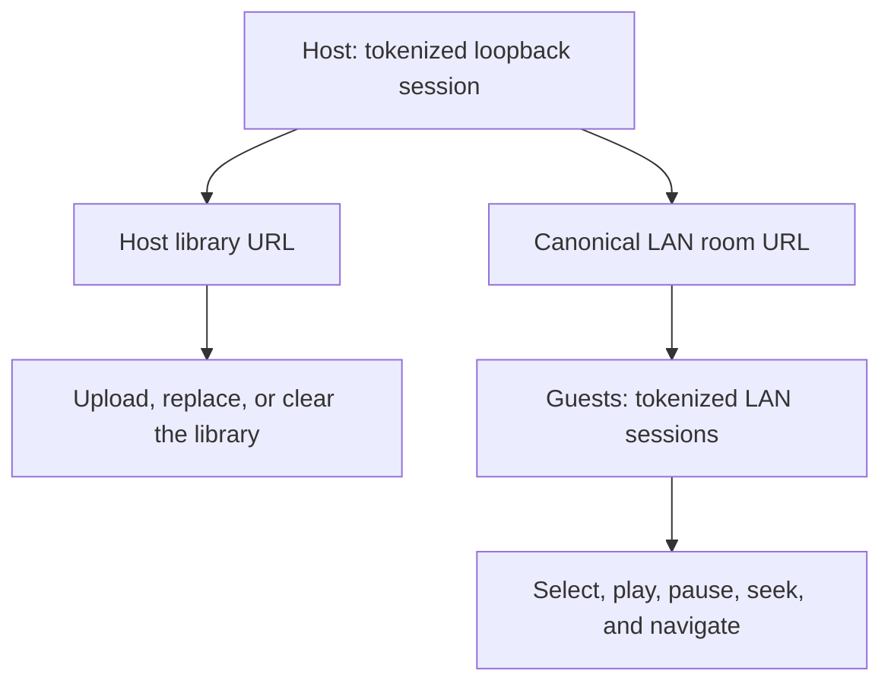
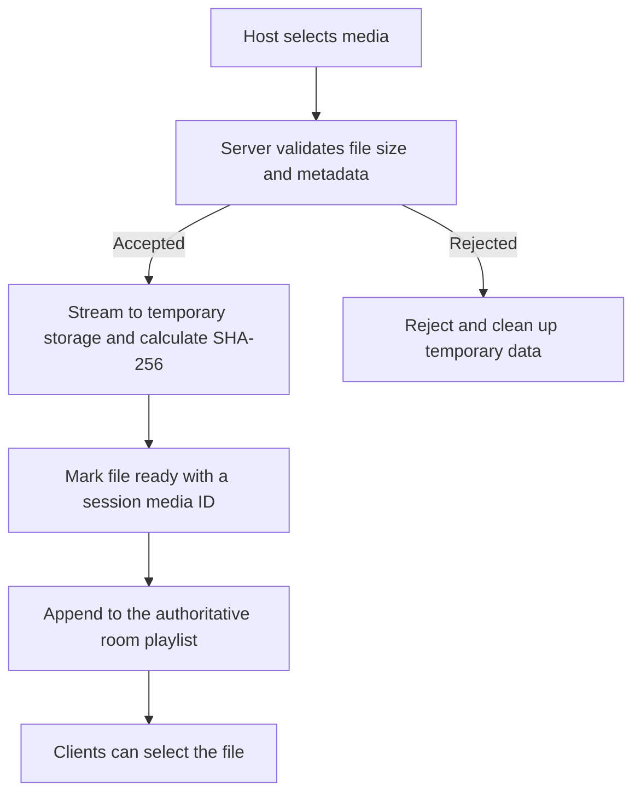
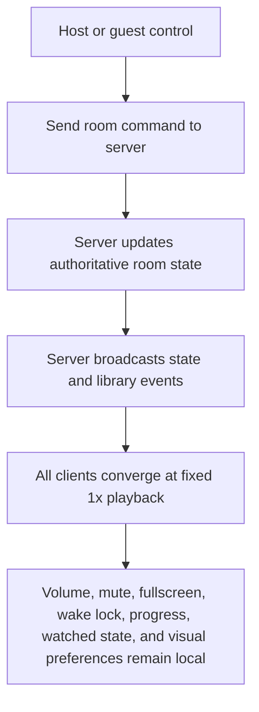

# LAN shared playback details

This guide supports the [English README](../README.md) and [Spanish README](../README.es.md). Use shared playback only on a trusted local network; it is not an Internet-sharing service.

## Host and client roles

Start shared mode explicitly:

- Portable Windows package: run `LAN.cmd`.
- Windows Command Prompt source checkout: `set "SHARE_LAN=1" && npm run web`.
- Windows PowerShell source checkout: `$env:SHARE_LAN = '1'; npm run web`.
- Linux/WSL source checkout: `SHARE_LAN=1 npm run web`.

The host and clients must be on the same Wi-Fi/LAN, without guest-network client isolation. Allow the Node server through Windows Firewall on **Private** networks when prompted; if needed, permit inbound TCP port `3000` on the private LAN.

The startup output provides two protected URLs:



| URL | Use |
| --- | --- |
| **Host library URL** (`127.0.0.1` with `?token=...`) | Open only on the host to add media or clear the library. |
| Canonical LAN room URL | Send unchanged to guests. It includes the bearer token. |

The server selects a usable physical Ethernet/Wi-Fi IPv4 address in preference to virtual, WSL, Docker, Hyper-V, or VPN-like adapters. If none is usable, it falls back safely to the tokenized loopback URL. The in-page clipboard control uses server-provided session metadata; it does not rebuild a share link from the browser address.

The room token is a bearer secret: anyone with the complete URL can view uploaded media and control the room until the host stops the server. Do not post it publicly. A LAN-IP room URL opened on the host is intentionally a guest session.

Only a tokenized request whose actual TCP peer is loopback (`127/8`, `::1`, or IPv4-mapped loopback) can upload, replace, or clear the library. The server does not trust `Host`, `Origin`, or forwarded headers for this decision. Guests can use shared playback controls, but Folder, File, and Clear remain host-only.

## Upload lifecycle and limits

The default maximum is **100 GiB per file** (`107374182400` bytes). Before starting the server, set `MAX_UPLOAD_BYTES` to a positive whole-number byte count to change it; decimal values and `GB`/`GiB` suffixes are invalid.

```bash
MAX_UPLOAD_BYTES=107374182400 SHARE_LAN=1 npm run web
```

The example sets a 100 GiB cap on Linux/WSL. In PowerShell, set `$env:MAX_UPLOAD_BYTES = '107374182400'` before the shared-mode command. Startup output reports the effective byte value and GiB equivalent. A changed variable does not affect a running listener: stop it and start the intended server again.

The server validates the cap before accepting an upload and streams accepted uploads to temporary files. Rejected, oversized, partial, and aborted uploads are cleaned up. Each file is assigned a random session media ID while its SHA-256 content identity is calculated during streaming.



In the host Playlist panel, selected files progress through preparing, percentage, transferred/total bytes, ready, and error. Ready files append immediately to the authoritative room playlist, so clients can select them while later files still copy. A later upload never replaces existing room media or playback state. Clear is the distinct global action that removes the complete room library and resets shared playback.

When the room begins empty, the first upload is centered in the usable panel area. It enters over 2.5 seconds through randomized small square/block fragments; when its first item is ready, matching centered and fixed-footer representations crossfade for a synchronized 3 seconds using the same continuous batch value. Later uploads enter the centered footer directly with the same 2.5-second randomized small-pixel entrance while only the playlist scrolls. Real XHR byte progress advances continuously over the selected batch, including each file ordinal, without resetting between sequential files. After the last upload, a 2.5-second randomized small-pixel/block exit completes before reserved list space is released. These transitions are disabled when reduced motion is preferred.

Uploaded files are temporary and are removed on ordinary server shutdown. Closing a browser tab does not remove them.

## Shared playback behavior and limits



Selection, play/pause, seek, Previous, and Skip next synchronize at a fixed 1× rate. Volume, mute, fullscreen, wake lock, progress, watched state, and visual preferences stay client-local. A guest's progress never changes the room position.

Shared playback is direct browser playback only. There is no transcoding, remuxing, subtitle processing, QR discovery, or Internet relay. Every client browser must support both the media container and its codecs; an `.mkv`, `.mov`, or `.mp4` can still fail when its codecs are unsupported.

If audible autoplay is blocked for a remote client, that client remains muted to preserve synchronization. A subtle full-surface prompt lets the viewer tap to enable audio locally without affecting shared playback or system audio.

## Mobile fullscreen gestures

| Context or gesture | Behavior |
| --- | --- |
| Eligible surface | Interactions apply only to direct touches on the safe video-frame or control-dock background, never buttons or ranges. |
| Enter fullscreen | The fullscreen button, `F`, and a non-fullscreen double-tap first request element fullscreen for the video frame. Use the CSS immersive fallback only when element fullscreen is unavailable, rejected, or confirmed to fail. |
| Stationary tap | Reveals controls. |
| Double-tap left or right third | Seeks back or forward 10 seconds. Repeated feedback accumulates per client (`-10`, `-20` or `+10`, `+20`); changing direction resets that client's label without changing the shared seek command. |
| Double-tap center third | Toggles play/pause and shows a responsive centered icon, smaller on phones. |
| Established vertical move in right third | Activates only after sufficient movement, then continuously adjusts only that device's video volume in either direction. Diagonal noise is not classified prematurely; the gesture does not reveal controls or seek. |
| Horizontal swipe or brightness | Horizontal swipes have no playback meaning. There is no brightness gesture. |
| Fullscreen surface | Disables touch scrolling and pinch zoom so it can capture swipes reliably; buttons and ranges retain native interactions. |
| Exclusions | Gestures do not apply to the seek range, long presses, or context menus. |
| Wide screens | The dock keeps seek and playback controls on one row when space permits and uses its compact two-row layout only when necessary. |

## Manual two-browser validation

1. Start shared mode. Open the tokenized Host library URL in Browser A and upload several small supported videos.
2. Confirm the first upload has its 2.5-second centered fragment entrance, then its synchronized 3-second crossfade to the footer when the first item becomes ready. Confirm later uploads enter the footer, ready files appear immediately and remain selectable during later copies, batch progress advances continuously, and the footer exit releases space only after 2.5 seconds. Repeat with reduced motion enabled and confirm these transitions are disabled. Confirm Clear removes the whole room library and resets shared playback.
3. Open the same complete protected room URL in Browser B, another profile, device, or LAN client. Confirm the playlist loads.
4. From both browsers in turn, select media, play, pause, seek, use Previous, and use Skip next. Confirm the other browser converges at fixed 1× playback.
5. Use the compact header clipboard control and confirm its success toast. Paste the result in a safe test location and confirm the token is retained without being displayed in the page UI.
6. In a LAN guest session, try Folder, File, and Clear. Confirm each produces the host-only message without opening a picker or changing the library. Confirm the tokenized localhost host session can perform those actions.
7. On a phone or tablet, test portrait and landscape fullscreen, rotation, the button/`F`/double-tap fullscreen routes, left/right/center double-taps, the right-third vertical volume gesture, and no-op horizontal swipes. Confirm touch controls and keyboard controls still work, while pinch/scroll is suppressed only on the fullscreen surface.
8. Where the browser permits it, long-press and open a video-frame context menu; confirm UI hardening suppresses these affordances where supported. This does not make authorized streamed media inaccessible.
9. Stop the server and confirm the temporary session is no longer reachable.
